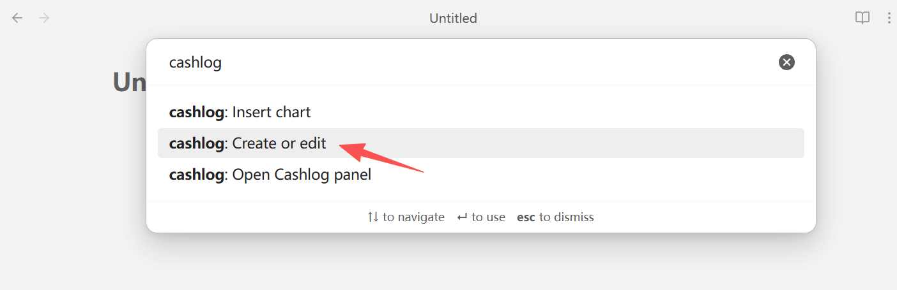
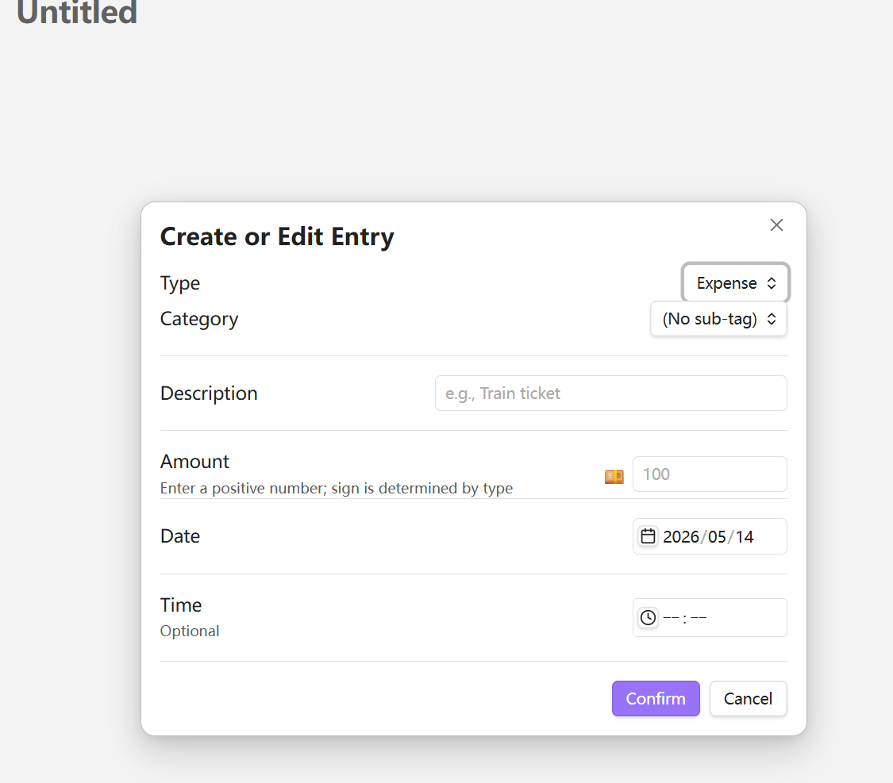
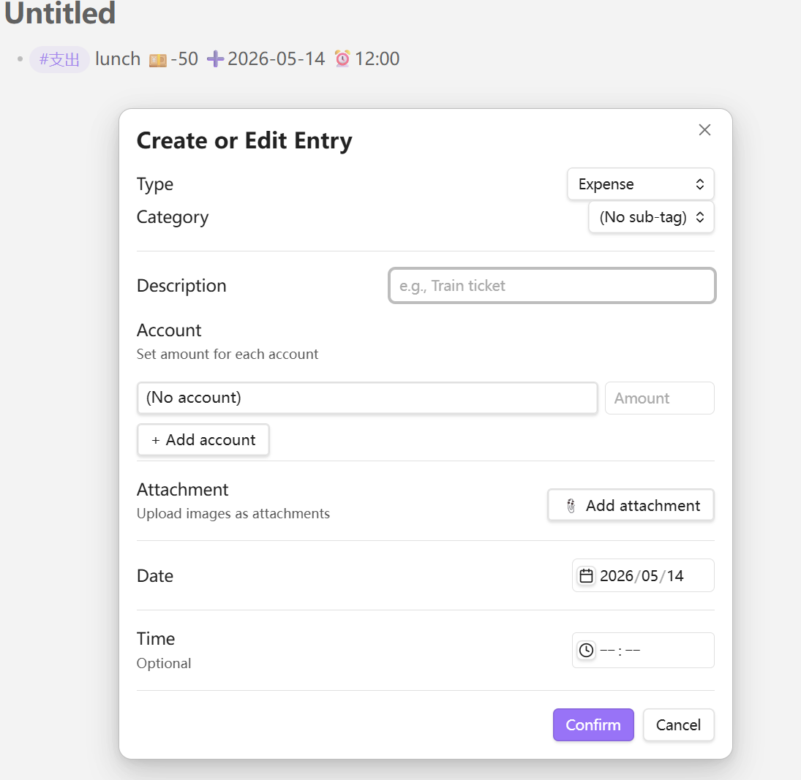
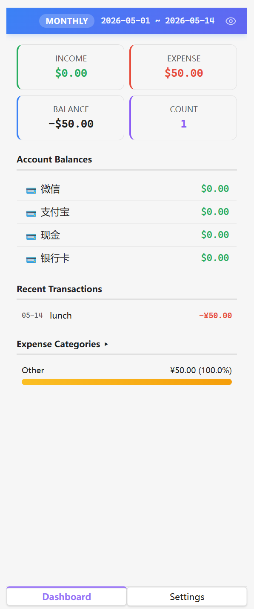
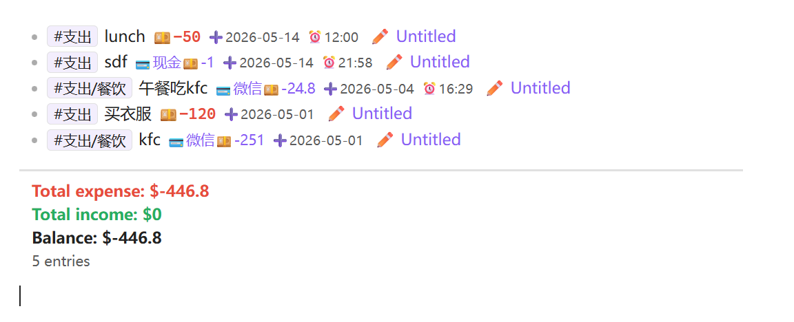
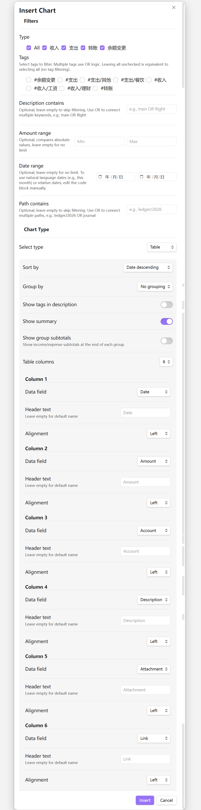
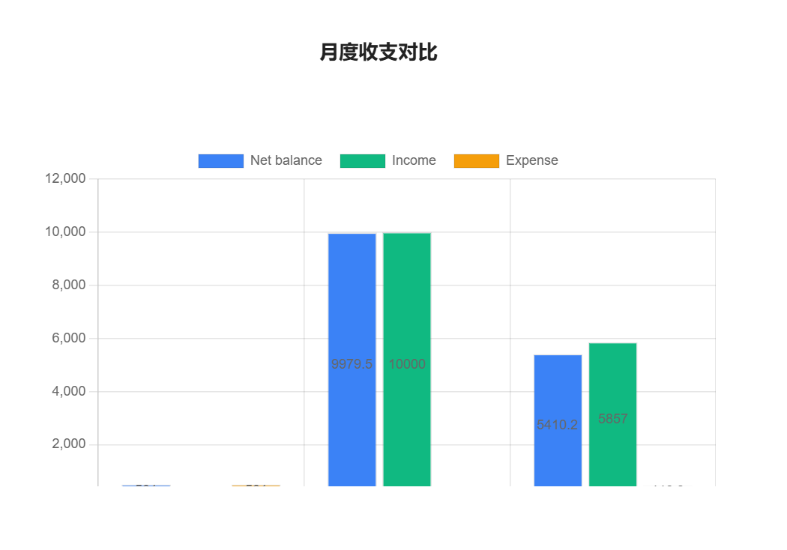
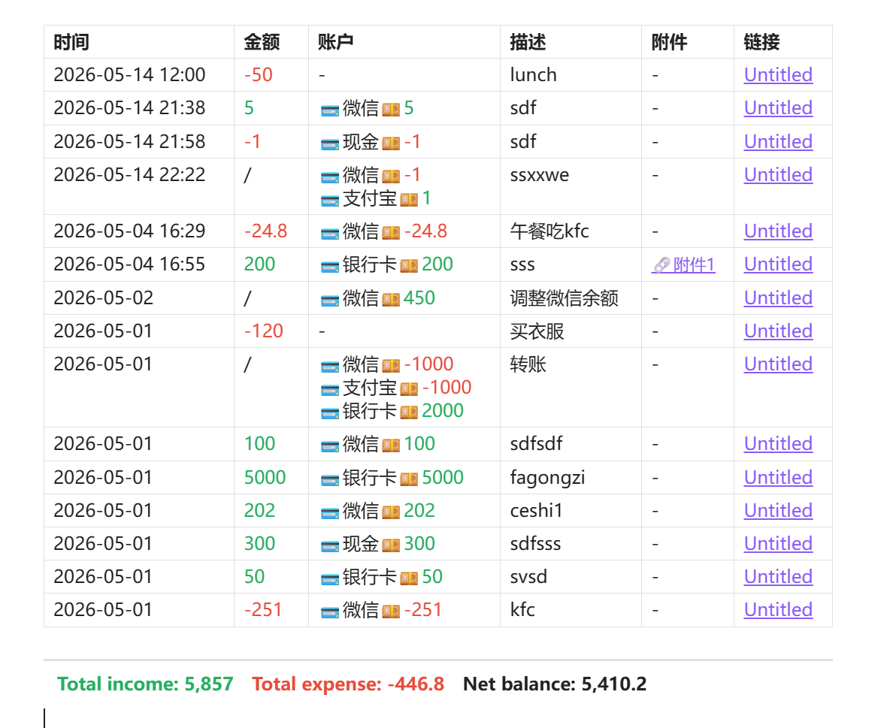
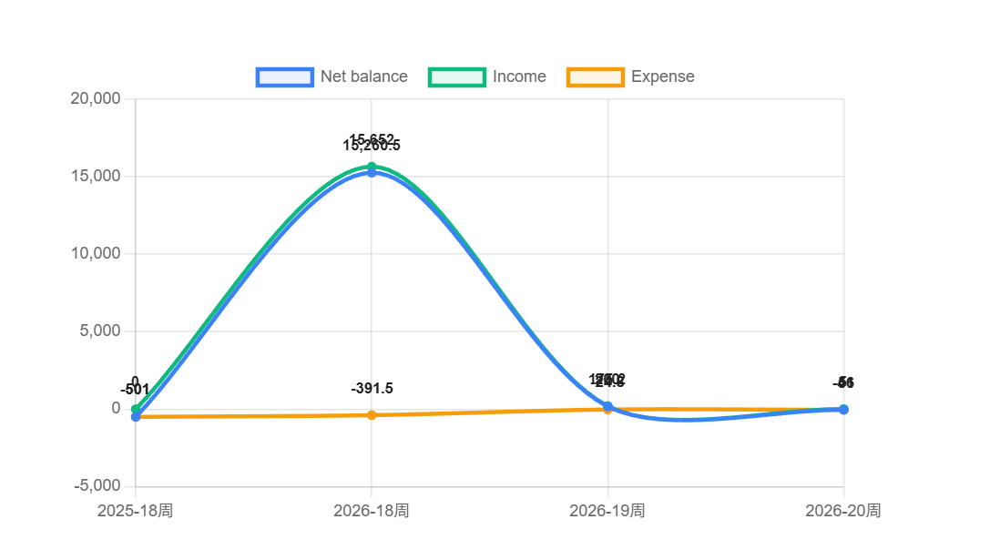
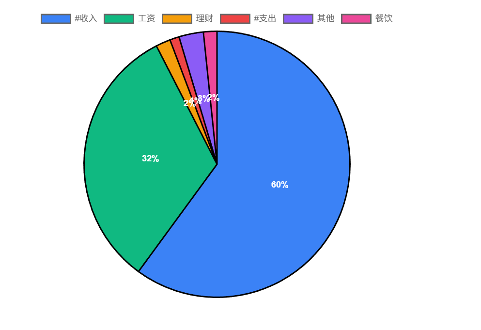

# Cashlog

A personal finance tracking plugin for [Obsidian](https://obsidian.md). Record income and expenses directly in your Markdown notes with an emoji-based syntax, then query, visualize, and analyze your data — all within your vault.

**[中文文档](https://github.com/uuq007/obsidian-cashlog/blob/main/README_zh.md)**

**[使用手册](https://github.com/uuq007/obsidian-cashlog/blob/main/使用手册.md)**

**[USAGE](https://github.com/uuq007/obsidian-cashlog/blob/main/USAGE.md)**


---

## Features

- **Markdown-native bookkeeping** — Record transactions as plain list items using emoji markers (`💴 ➕ ⏰`)
- **Tag categorization** — Classify entries with hierarchical tags like `#expense/food`, `#income/salary`
- **Query language** — Filter, sort, group, and summarize entries in `cashlog` code blocks
- **Chart visualization** — Bar charts, line charts, pie charts, and custom tables via `cashlog-chart` blocks
- **Dashboard panel** — Interactive side panel with summary cards, account balances, budgets, and goals
- **Multi-account support** — Track multiple accounts (WeChat, Alipay, bank cards), transfers, and balance adjustments
- **Budgets & goals** — Set spending budgets and income goals with period-aware progress tracking
- **Attachments** — Attach receipt photos to entries, stored in your vault
- **i18n** — English and Chinese UI
- **Natural language dates** — `date today`, `date last month`, `date 14 days ago`, etc.

## Quick Start

### Record a transaction

Use the command palette (`Ctrl+P`) → `Create or edit cashlog`, or write manually:

```markdown
- #expense/transport train ticket 💴-100 ➕2026-04-25 ⏰17:30
- #income/salary monthly pay 💴10000 ➕2026-04-25
```

| Symbol | Meaning | Format |
|--------|---------|--------|
| `💴` | Amount | `💴` + number (negative = expense) |
| `➕` | Date | `➕` + YYYY-MM-DD |
| `⏰` | Time | `⏰` + HH:mm |





After enabling the account and attachment features in the plugin settings, the full create/edit menu looks like this:




## Dashboard Panel

Open via command palette → `Open Cashlog Panel`. The panel provides:



- **Summary cards** — Income, expense, balance, count for the current period
- **Account balances** — Real-time balance for each account with drill-down details
- **Budget progress** — Spending vs. budget with period-aware tracking
- **Goal progress** — Income achievement vs. target
- **Recent transactions** — Last 10 entries with hover details
- **Category ranking** — Top 5 expense categories with percentage

All dashboard areas are clickable for drill-down navigation.


### Query your data

````markdown
```cashlog
is expense
date this month
sort by date descending
show total expense
```
````



### Visualize with charts

Use the command palette (`Ctrl+P`) → `Insert chart`, or write manually:



````markdown
```cashlog-chart
group by month
chart type bar
chart title "Monthly Overview"
chart bar split by valueType
chart legend true
```
````









## Entry Format

### Basic

```markdown
- #expense/food lunch 💴-25 ➕2026-04-25 ⏰12:00
```

### With account

```markdown
- #expense/shopping clothes 💳WeChat💴-200 ➕2026-04-25
```

### Transfer

```markdown
- #transfer pay credit card 💳Alipay💴-500 💳ICBC Card💴500 ➕2026-04-25
```

### Balance adjustment

```markdown
- #balance-change adjust balance 💳Alipay💴50 ➕2026-04-25
```

### With attachments

```markdown
- #expense/shopping clothes 💳WeChat💴-200 🧷[[cashlog-2026042517303050|receipt]] ➕2026-04-25
```

## Query Syntax

Use `` ```cashlog `` code blocks to query entries across your entire vault.

### Filters

| Instruction | Description |
|-------------|-------------|
| `is income` / `is expense` / `is transfer` | Filter by type |
| `tag includes #expense/food` | Tag contains (supports OR) |
| `description includes lunch` | Description contains text (supports OR) |
| `amount above 100` | Amount absolute value comparisons |
| `date this month` | Date filtering (natural language, ranges, etc.) |
| `account is WeChat` | Account filtering (supports OR) |
| `path includes journal/` | File path filtering |
| `has attachment` | Only entries with attachments |

### Sorting

| Instruction | Description |
|-------------|-------------|
| `sort by date descending` | Sort by date |
| `sort by amount descending` | Sort by amount |
| `sort by description ascending` | Sort by description |

### Grouping

| Instruction | Description |
|-------------|-------------|
| `group by tag` | Group by tag |
| `group by month` | Group by month |
| `group by account` | Group by account |
| `group by type` | Group by entry type |

### Summaries

| Instruction | Description |
|-------------|-------------|
| `show total` | Total income, expense, balance, count |
| `show total expense` | Total expense only |
| `show balance` | Balance only |
| `show count` | Entry count only |

### Date formats

```
date 2026-04-25              # specific date
date today                   # natural language
date this month              # relative range
date 2026                    # full year
date 2026-04                 # full month
date 2026-W15                # ISO week
date 2026-Q2                 # quarter
date 2026-01-01 2026-03-31   # absolute range
```

## Charts

Use `` ```cashlog-chart `` code blocks to render visualizations powered by Chart.js.

| Type | Instruction |
|------|-------------|
| Bar chart | `chart type bar` |
| Line chart | `chart type line` |
| Pie chart | `chart type pie` |
| Table | `table columns N` + `colN field "header" alignment` |

### Chart options

| Instruction | Description |
|-------------|-------------|
| `chart title "Title"` | Chart title |
| `chart width 800` | Width in pixels |
| `chart height 400` | Height in pixels |
| `chart legend true` | Show legend |
| `chart labels true` | Show data labels |
| `chart bar split by valueType` | Split bars by value type |
| `chart line split by tag` | Split lines by tag |
| `chart value income` | Pie chart value mode |


## Installation

### Manual

1. Download `main.js`, `manifest.json`, and `styles.css` from the [latest release](https://github.com/uuq007/obsidian-cashlog/releases)
2. Copy them to `.obsidian/plugins/obsidian-cashlog/` in your vault
3. Enable the plugin in Obsidian Settings → Community Plugins

### Build from source

```bash
git clone https://github.com/uuq007/obsidian-cashlog.git
cd obsidian-cashlog
npm install
npm run build
```

## Settings

| Category | Options |
|----------|---------|
| Tags | Customize income/expense/transfer/balance-change tag names; auto-migration on rename |
| Sub-tags | Add, rename, merge, or delete sub-tags; auto-discovered from vault |
| Accounts | Enable multi-account, add/rename/delete accounts, set initial balances |
| Attachments | Enable file uploads, configure storage directory |
| Budgets | Set spending limits with period (weekly/monthly/yearly/custom) and tag filters |
| Goals | Set income targets with period and tag filters |
| Statistics | Period mode (daily/weekly/monthly/yearly), custom start dates |
| Paths | Include/exclude vault paths from indexing |

## Requirements

- Obsidian v1.7.2+

## License

MIT
